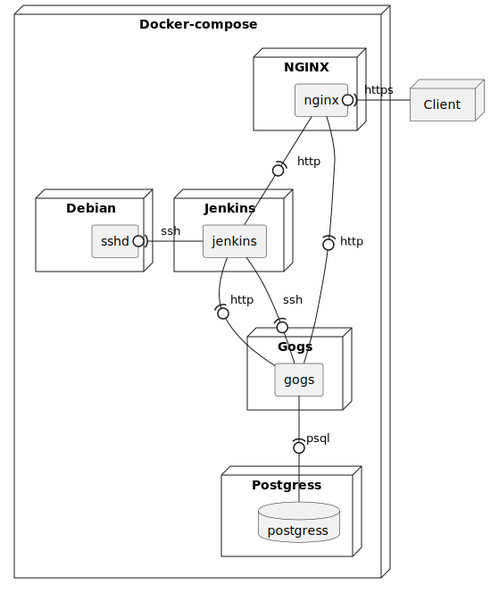

# CI/CD
Docker (gogs + jenkins)

## Deploy diagram

## Links
- `https://gogs.localhost:8443/`
- `https://jenkins.localhost:8443/`

## Jenkins
- [embeddable-build-status](https://plugins.jenkins.io/embeddable-build-status/)
- 

## Jenkins plugins
 - job build plugin
 - markdown status plugin
 - docker pipeline plugin
 - unit testing plugin
 - code coverage plugin
 - testing reporting plugin
 - matrix authorization strategy