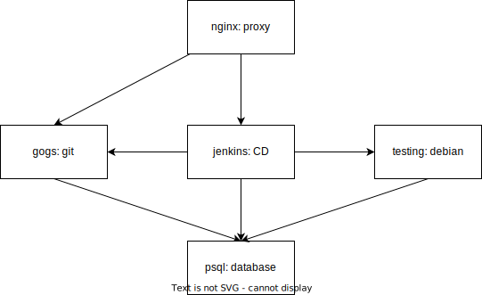

# CI/CD
Docker (gogs + jenkins)

## Architecture

## Links
- `http://localhost:2343/gogs/`
- `http://localhost:2343/jenkins/`

## Jenkins
- [embeddable-build-status](https://plugins.jenkins.io/embeddable-build-status/)
- 